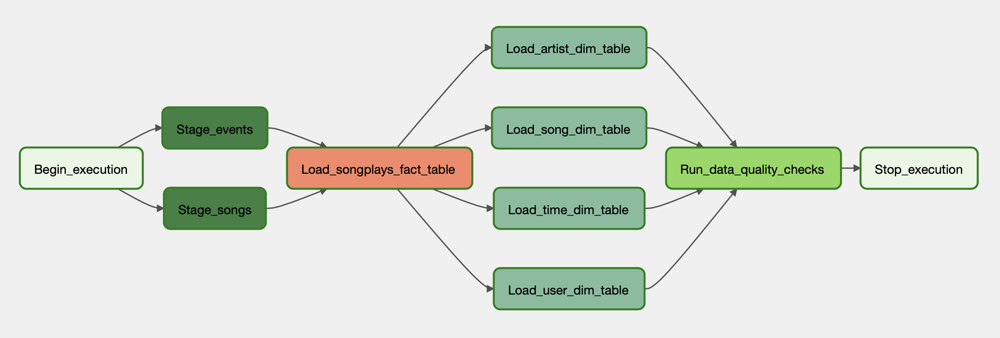

# Sparkify Airflow Pipeline

## Sparkify

Sparkify is a learning project which aims at analyzing collected data from songs and user activity on a music streaming app. Analysts want to understand what songs users are listening to. Currently, they don't have an easy way to query their data, which resides in a directory of JSON logs on user activity on the app, as well as a directory with JSON metadata on the songs in their app.

## Datasets

### Songs Dataset

The first dataset is a subset of real data from the [Million Song Dataset](http://millionsongdataset.com). Each file is in JSON format and contains metadata about a song and the artist of that song. The files are partitioned by the first three letters of each song's track ID.

### Logs Dataset

The second dataset consists of log files in JSON format generated by this event simulator based on the songs in the dataset above. These simulate activity logs from a music streaming app based on specified configurations. The log files in the dataset are partitioned by year and month.

## Prerequisites

- AWS Redshift Cluster
- AWS User with programmatic access and has an S3Read policy attached
- Install [Airflow](https://airflow.apache.org/docs/apache-airflow/stable/installation/) v2.3.x
    - Install [Amazon], [Postgres] via extras and providers
- Install the custom [plugins](plugins) as a Python Module with the provided [setup.py](setup.py) file.

  
## Start Airflow (Standalone)

1. For development purposes, start Airflow in standalone mode by running  `airflow standalone`. This will start the webserver, scheduler, and the workers at the same time.

2. Once the webserver is running, you can access it through your favourite web browser using this url `http://localhost:8080`.

3. Create connections on the Airflow web server through the Admin panel for both Redshift and your AWS User.

4. When your Redshift cluster is up and running, you can create database tables of the defined schema using the [create tables](create_tables.sql) script.

5. Create a .env file with all configurations of the cluster, s3, and schema. An example is provided [here](.env.example).

6. Change the configurations of Airflow to point to the dags and the plugins folders of this repo. The config file is by default located in this path: `~/airflow/airflow.cfg`

7. Use the Airflow UI to enable your dag for the first time which will run the last interval only then runs every hour as per the scheduling setup.

## Dag Flow

The following flow represents the tasks the dag executes on an hourly basis.

## Schema

The following schema is following the [star schema](https://en.wikipedia.org/wiki/Star_schema) concept for DWHs. It is efficient for storing data and quering it in a relational DB.   

